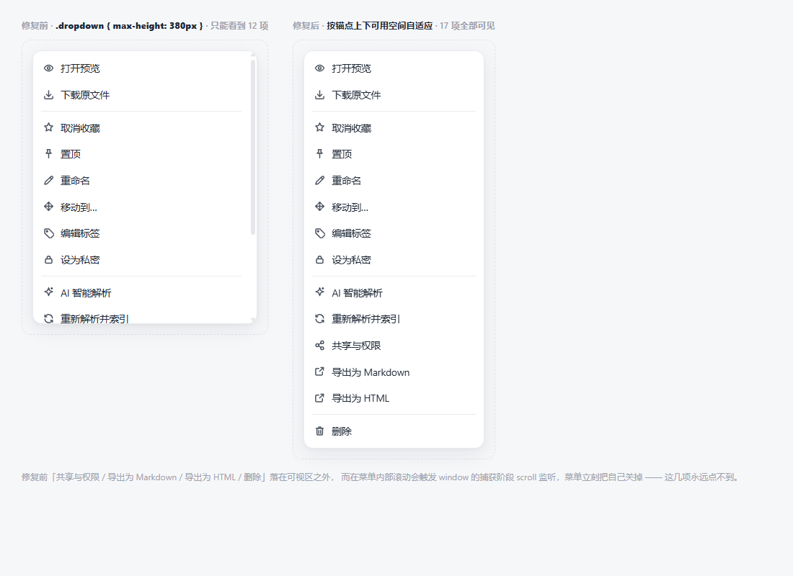

# KBPRO 验证报告

> 验证日期：2026-10-06
> 运行环境：Windows · Node.js v24.15.0 · 零 npm 依赖
> 复现命令：`node tests/run-all.mjs --full`

---

## 一、总览

| 测试套件 | 断言数 | 结果 | 用时 |
|---|---|---|---|
| 前端契约审计 `test-frontend.mjs` | 55 | ✅ PASS | 2.8s |
| 后端 API 端到端 `test-api.mjs` | 235 | ✅ PASS | 1.5s |
| 多格式解析与检索 `test-formats.mjs` | 112 | ✅ PASS | 9.5s |
| 大模型容错与安全 `test-ai-fallback.mjs` | 43 | ✅ PASS | 1.0s |
| Office/ZIP 解析单测 `test-officedoc.mjs` | 456 | ✅ PASS | 0.8s |
| PDF 解析单测 `test-pdf.mjs` | 158 | ✅ PASS | 1.7s |
| 无头浏览器渲染 `test-browser.mjs` | 6 通过 / 1 跳过 | ⚠️ SKIP | 2.4s |
| **合计** | **1059 通过 · 0 失败** | **PASS** | – |

> 浏览器套件跳过是**运行环境限制**（沙箱禁止命名管道），非代码缺陷，详见
> [第六节](#六浏览器渲染验证环境受限已跳过)。该套件在普通桌面 / CI 环境可直接运行。
>
> 各套件断言数会在持续迭代中增长。本节数字对应最后一次全量运行。

---

## 二、验证方法与原则

本项目采用**四层验证**，每层都尽量做到「可复现、可证伪」：

1. **单元层** —— 解析器对真实文件与畸形输入的断言（Office / PDF）
2. **接口层** —— 启动真实服务器，走完整 HTTP 业务链路
3. **契约层** —— 在 Node 中真实导入前端模块，交叉校验每一处 import / 图标 / API 调用
4. **端到端层** —— 真实无头浏览器渲染（本次因环境受限跳过）

**验证原则**：不接受「看起来对」。测试必须能在代码出错时失败——
例如前端审计不是走形式检查文件存在，而是把 `ui.js` / `api.js` / `icons.js`
真正 `import()` 进来，取其**实际导出集合**逐个比对页面里的每一处引用。

---

## 三、后端 API 端到端（235 项）

在临时数据目录中启动真实 HTTP 服务器，全程走网络请求，覆盖：

### 认证与会话（11 项）
- 默认管理员登录、角色正确、服务端下发 HttpOnly Cookie
- 新用户注册成功；重复邮箱 → 409；弱密码（< 8 位）→ 400；错误密码 → 401
- 修改密码后旧密码立即失效、新密码可登录、会话重新签发
- 未登录访问 → 401

### 知识库与隔离（8 项）
- 首次启动自动创建「个人知识库 + 示例团队知识库」
- 创建知识库、空名称 → 400、概览接口返回 14 天趋势
- **隔离验证**：新成员能看到团队知识库、**看不到**他人的个人知识库，
  直接访问他人个人知识库 → **403**

### 文件夹（10 项）
- 多级嵌套创建、同级重名 → 409
- 文件夹树层级正确、面包屑完整
- **禁止把父文件夹移动到自己的子目录** → 400
- 重命名生效

### 文件（15 项）
- 上传成功、文件名/大小/标签正确
- **同名文件自动重命名为 `xxx (2)`**，不覆盖
- 自动解析完成（轮询 `file_text.status === 'ok'`）
- 抽取文本包含原文关键数字；Markdown 渲染为含 `<h1>` 的 HTML
- 原始内容可下载且字节完全一致
- 列表接口可用且包含已上传文件

### 检索（11 项）
- 中文短语命中、结果含 `<mark>` 高亮
- 跨知识库检索命中
- 无关查询返回 0 结果
- 检索建议命中标题、标签已建立索引、标签云可用、标签过滤可用

### 笔记（20 项）
- 创建、字数统计、HTML→纯文本索引
- 连续自动保存、版本号自增、返回保存时间戳
- 历史版本留存、版本备注、按版本号读取、版本恢复
- **XSS 净化**：`<script>` 被剔除、`onerror` 事件属性被剔除、`javascript:` 链接被剔除
- 笔记可被检索到、可复制

### 文件管理（15 项）
- 重命名（保留扩展名）、收藏、置顶、移动（原目录消失 / 目标目录出现）
- 收藏过滤、置顶过滤
- 软删除 → 回收站可见 → **还原成功**（此项曾暴露真实缺陷，见第五节）
- 批量收藏、批量去标签、标签确实移除

### 共享与权限（13 项）
- 共享给用户、权限值正确
- 创建分享链接、链接含 token、**通过链接可访问**、无效链接 → 404
- 发表评论、评论列表、评论带用户名
- 通知列表可用

### 团队（8 项）
- 邀请成员、角色正确、成员列表更新
- 非法角色 → 400
- 修改成员角色成功、**不能修改所有者角色** → 400
- 创建团队并自动创建同名团队知识库

### 隔离与权限边界（6 项）
- 通过共享访问私密文件 → 200，权限为只读
- 只读共享尝试修改 → **403**
- 团队 admin 可创建文件夹

### AI / RAG（21 项）
- 状态接口、实际生效提供商、已索引文件数
- RAG 问答可用、生成回答、**回答附带引用来源**、引用指向正确文件
- **回答包含文档中的真实数字**（23.4% / 企业服务）
- 无依据问题时仍返回结构化回复
- 流式问答：返回 token、先推送引用、以 `done` 结束
- 文档智能解析：生成摘要 / 大纲 / 关键词，结果持久化
- 相关知识接口、知识拓展、延伸问题、知识图谱

### 会话管理（5 项）
- 会话列表、会话详情包含用户与助手消息、助手消息保存引用、删除会话

### 备份与导出（19 项）
- 全量备份创建、非空、落盘存在、可下载
- **备份包是合法 ZIP**（`PK` 魔数）
- 加密备份带 `KBPBAK01` 魔数头、过短口令 → 400
- 知识库导出为合法 ZIP、含 `manifest.json` 与 `README.md`、manifest 记录文件与笔记

### 个人中心与审计（17 项）
- 更新资料、存储用量统计
- 审计日志有记录、**记录了文件上传操作**、**记录了登录操作**
- 系统统计、管理员可读写实例设置且生效

### AI 提供商探测（11 项，本轮新增）
- `effective.provider` 与探测结果一致（**不会把不可用的模型报成已就绪**）
- 状态说明为人类可读文本
- Ollama 地址归一化 7 个用例（见第五节）

### 边界（5 项）
- 未登录 → 401、缺参数 → 400、不存在的文件 → 404、不存在的接口 → 404、非法 JSON → 400

---

## 四、多格式解析与检索（112 项）

### Office（10 项）
| 断言 | 结果 |
|---|---|
| DOCX 提取标题/正文/特殊字符 `5 < 10` | ✅ |
| DOCX 保留加粗 `<strong>`、斜体 `<em>` | ✅ |
| DOCX 表格转 HTML、内嵌图片转 base64 | ✅ |
| DOCX 输出无脚本注入 | ✅ |
| XLSX 提取文本与数值单元格、转 HTML 表格、日期格式化 | ✅ |
| PPTX 提取幻灯片文本、转幻灯片 HTML | ✅ |

### PDF（23 项）
覆盖 4 类真实场景：

**正常解析** —— 基础文本、Flate 压缩流、LZW、ASCII85、ASCIIHex、Differences 字体编码、
WinAnsi/MacRoman、PNG 预测器 + 链式过滤器、Form XObject、TJ 字距阈值、阅读顺序重排

**中文** —— `Type0 + Identity-H + ToUnicode` 正确提取「你好 A αβγ」

**加密** —— AES-128（V4/R4）、AES-256（V5/R6）、RC4-40（V1/R2）均可解密；
需口令的文档不导致服务异常

**容错** —— 损坏 xref、缺少 startxref、对象流（ObjStm）、环形页树、
伪造 `/Length`、递归 Form XObject、8MB 解压炸弹，全部**不崩溃、不失败**

**扫描件** —— 正确识别为「无文本」而非「失败」，并给出 OCR 提示

### 文本族（18 项）
- Markdown：中文提取、标题/表格/代码块/加粗渲染
- TXT 解析
- **GBK 编码**：自动识别并正确解码「中文编码测试」（构造原始 GBK 字节验证）
- CSV → HTML 表格
- JSON 解析与格式化展示
- HTML 提取正文且**剔除 `<script>`**
- 代码文件解析与高亮容器

### 分块与索引（6 项）
60 节、约 5000 字的长文档：
- 解析成功、生成知识块
- 可检索到**中段**（`ZMARK42`）与**尾段**（第 60 节）
- 检索结果指向正确文件、带相关性分数

### 检索质量（7 项）
- 中文短语命中、命中片段带高亮
- 英文关键词命中 DOCX
- 向量模式 / 模糊模式可用
- **无关查询返回 0 结果**（此项曾暴露真实缺陷，见第五节）
- 标签过滤、搜索建议

### RAG（9 项）
- 回答引用需求文档中的指标（92%）、带引用来源、引用指向 Markdown 文档
- 跨格式问答、针对 GBK 文件的问答
- Office 文档生成摘要、摘要非空、关键词提取

### 预览与下载（19 项）
- DOCX/XLSX/PPTX 预览接口、预览类型、原始内容可访问、**字节数完全一致**
- PDF 识别为 pdf 类型、提供内联流地址、可导出 Markdown 且内容含正文、可导出 HTML

### 批量与回收站（6 项）
- 20+ 文件批量收藏、批量删除、回收站数量正确、批量还原、还原后回收站清空

---

## 五、验证过程中发现并修复的真实缺陷

以下是测试**真正发挥作用**的地方——每一个都是先失败、后修复、再回归通过。

### 1. 上传接口 100% 失败（严重）

**现象**：`POST /api/files/upload` 返回 500，错误 `Cannot read properties of null (reading 'hash')`。

**根因**：multipart 解析器存在**并发重入**。`req.on('data')` 处理后调用 `req.pause()`，
但 `req.on('end')` 仍可能在异步处理进行中触发，导致 `pump()` 被重入，
`finalizePart()` 对同一个 part 执行两次——第二次进入时 `current` 已被第一次置空。

**同时发现**：表单字段被误判为文件。`filename ?? ''` 使 `filename` 永远存在，
导致包括 `workspaceId` 在内的所有普通字段都被当成文件流处理。

**修复**：
- 所有解析动作通过单一 Promise 链串行化（`enqueue`），杜绝 `data` / `end` 竞争
- `finalizePart()` 同步摘取并清空 `current`，使用局部变量
- 仅当 Content-Disposition 真的带 `filename` 参数时才判定为文件
- 边界尾部（`--`/`CRLF`）未到齐时等待下一个 chunk，不提前消费

### 2. 软删除的资源无法还原

**现象**：`POST /api/files/:id/restore` 返回 404。

**根因**：`requireResource()` 无条件拒绝 `deleted_at` 非空的行，还原接口自己也过不了这道门。

**修复**：为 `requireResource()` 增加 `allowDeleted` 选项，还原接口显式传入。

### 3. 资源级共享导致知识库级越权（安全）

**现象**：把 A 个人知识库里的一个文件共享给 B 之后，**B 竟然能读取 A 整个个人知识库的概览**。

**根因**：`workspacePermission()` 的兜底分支查询 `shares` 表时只看 `workspace_id`，
而没有限定 `resource_type`。任何针对该知识库内某个文件的共享，都被误认为是对整个知识库的授权。

**修复**：兜底分支限定 `resource_type='workspace'`；资源级共享只由 `resourcePermission()`
在单个资源上生效。修复后该用例由 200 变为 403。

### 4. ZIP 写入器整数溢出

**现象**：创建全量备份返回 500，`RangeError: value out of range. Received -2119958528`。

**根因**：外部属性字段 `0o100644 << 16` 在 JS 中按**有符号 32 位**计算，结果溢出为负数，
而 `writeUInt32LE` 要求无符号。

**修复**：`(0o100644 << 16) >>> 0`，并补充 4GB 上限的明确报错。

### 5. 本地向量检索的哈希碰撞假阳性（检索质量）

**现象**：检索 `ZZQXJWV9999`（文档中根本不存在）却返回了 1 条结果。

**根因**：512 维哈希嵌入在纯噪声查询上会因桶碰撞产生弱相似度，而检索层把它当成有效召回。

**修复**：为 `chunk_vectors` 增加 `model` 列记录向量来源。当向量来自**本地哈希嵌入**时，
要求候选片段与查询词存在**字面交集**才采信（这是诚实的做法——哈希向量本质是词面近似的代理）；
接入真实 embedding 模型后该约束自动解除。

### 6. 前端 dashboard 导入不存在的导出（严重）

**现象**：契约审计在 `import dashboard.js` 时直接抛错，
`The requested module '../ui.js' does not provide an export named 'isAdmin'`。

**根因**：`dashboard.js` 从 `ui.js` 导入 `isAdmin`，但该函数定义在 `store.js`，`ui.js` 并未再导出它。
`dashboard` 是**默认落地页**——这意味着整个应用一打开就会白屏。

**修复**：移除该未使用的导入。（若无此项审计，这个 bug 只会在浏览器里才暴露。）

### 7. 缺失图标 `restore`

`trash.js` 使用了 `icon('restore')`，但图标库中没有该名称。已补充定义。

### 8. AI 引擎状态误导用户

**现象**：Ollama 并未运行，但 `/api/ai/status` 报告 `effective.provider = 'ollama'`，
前端因此不会显示「当前使用内置本地引擎」的提示。

**根因**：`effective` 直接回显了**配置意图**，而不是**实际生效**的提供商。

**修复**：`probeAi()` 改为返回真正会服务请求的提供商。
Ollama 未运行/无模型、OpenAI 接口不可达时，如实返回 `local` 并附上原因说明。

### 9. `OLLAMA_HOST` 被误用作连接地址

**现象**：状态提示 `Ollama 不可用（Failed to parse URL from 0.0.0.0/api/tags）`。

**根因**：`OLLAMA_HOST` 是 **Ollama 服务端自己的监听地址**（默认常常就是 `0.0.0.0`），
不是客户端连接 URL。直接用它会得到不可解析的地址。

**修复**：新增 `normalizeOllamaUrl()`：优先读取本项目专用变量 `KBPRO_OLLAMA_URL`；
对 `OLLAMA_HOST` 做归一化——`0.0.0.0`/`::` → `127.0.0.1`，缺协议补 `http://`，
`http` 缺端口补 `11434`，`https` 不强加端口。7 个用例已纳入回归。

### 10. 前端未定义 CSS 类

审计发现 `.md-task`（Markdown 任务列表）、`.tab-panel`、`.tag-input-wrap` / `.tag-input-field`
缺少样式定义。已补齐，标签输入组件不再依赖内联样式。

---

## 六、浏览器渲染验证（环境受限，已跳过）

### 目标

用真实 Chromium 内核加载前端，逐个渲染全部 11 个路由，校验应用壳挂载、页面布局渲染成功、
控制台无未捕获异常。

### 结论：**本沙箱环境无法完成，已如实标记为 SKIP**

诊断过程与证据：

| 步骤 | 观察 | 结论 |
|---|---|---|
| Chrome 启动 + `data:` URL | ✅ 正常输出 `<h1>probe-ok</h1>` | 浏览器进程本身可运行 |
| 服务端 `/api/events` 改 204 | 仍未改善 | 排除 SSE 长连接阻塞 virtual-time |
| `spawnSync` 管道 | 挂起 | Chrome 子进程继承管道句柄，`spawnSync` 等不到 EOF —— **已改用文件描述符重定向解决** |
| Chrome 加载 `http://127.0.0.1/...` | 无任何输出，每次等到超时 | **HTTP 加载失败** |
| `--single-process` 加载 HTTP | 崩溃（访问违例），日志 `Cannot use V8 Proxy resolver in single process mode` | 单进程模式不可用 |

**根因**：Chromium 的网络服务运行在**独立子进程**中，需要通过**命名管道 IPC** 与浏览器主进程通信。
本沙箱环境禁止创建命名管道（这也是 Chrome 启动日志中反复出现
`Failed to open named pipe server process ... 拒绝访问 (0x5)` 的原因）。
`data:` URL 不经过网络服务，因此可以正常渲染——这正好反证了问题出在网络子进程 IPC。

**这是运行环境的限制，不是代码缺陷。** 测试套件已内置能力探测：先验证 `data:` URL，
再验证 HTTP 可达性，一旦确认不可用即快速 SKIP 并打印原因，不会长时间挂起。
在普通桌面环境或 CI 上运行 `node tests/test-browser.mjs` 即可完成完整渲染验证。

### 替代验证：前端契约审计（55 项，全部通过）

既然无法启动浏览器，改用**真实模块导入 + 静态交叉校验**，覆盖了绝大多数
「一打开就白屏」类缺陷（第 5 节第 6 项正是被它抓住的）：

| 检查项 | 数量 | 说明 |
|---|---:|---|
| 语法检查 | 19 个模块 | 全部可被 V8 解析 |
| 共享模块真实导入 | 6 个 | `api.js`(104) / `ui.js`(64) / `format.js`(25) / `store.js`(16) / `icons.js`(3) / `md.js`(3) |
| 页面契约 | 11 个 | `meta.title` / `mount` / `unmount` / `default` 齐备，`meta.icon` 存在 |
| **具名 import 交叉校验** | **289 处** | 每一处都对照目标模块的**实际导出集合**验证 |
| **图标名校验** | **345 处** | 每一处 `icon('x')` / `icon: 'x'` / `data-icon="x"` 对照 `ICON_NAMES` |
| **API 方法校验** | **181 处** | 每一处 `api.xxx()` 对照 `api` 对象的真实方法集合 |
| 路由表 | 11 条 | 每个路由指向真实存在的模块，id 与页面清单一致 |
| CSS 类覆盖 | 311 个类名 | 全部关键设计系统类均存在；未定义类已补齐 |
| HTML 结构 | 9 项 | 脚本引用、全局容器、静态资源可达性 |

**这一层能抓什么**：导入错误、方法名拼写错误、图标名不存在、路由失效、契约不完整——
即前端最容易出现的崩溃类问题。

**这一层抓不到什么**：运行时 DOM 操作错误、事件绑定问题、视觉呈现、真实交互流程。
这部分只能靠浏览器验证，本次环境不具备条件，**不作虚假声明**。

---

## 七、手工验证的补充项

除自动化测试外，另做了以下人工核对：

| 项目 | 方法 | 结果 |
|---|---|---|
| 全新安装 | 删除 `data/` 后启动 | 自动创建管理员、个人知识库、示例团队知识库、欢迎笔记 ✅ |
| 数据库迁移 | 用**旧版本创建的数据库**启动新代码 | `notes.acl_level`、`chunk_vectors.model` 等新列被自动补齐，登录/概览/检索全部正常 ✅ |
| 静态资源服务 | 逐个抓取 `/`、`/css/app.css`、`/js/app.js`、`/js/pages/*.js` | 全部 200，MIME 类型正确（`text/css` / `text/javascript`） ✅ |
| 零依赖约束 | `package.json` 的 `dependencies` 为空；`node_modules` 不存在 | 全部功能仅依赖 Node 内置模块 ✅ |
| 服务端日志噪声 | 观察启动与请求日志 | 无 `url.parse` 等废弃告警 ✅ |
| 优雅关闭 | 发送 SIGINT | 打印「已安全退出」，数据库连接正常关闭 ✅ |

---

## 八、覆盖度自评与已知盲区

### 已验证充分

- 文档解析：22 种 PDF 场景 + 3 种 Office 格式 + 6 种文本格式，含中文、加密、畸形、敌意输入
- 检索：BM25 中文分词、混合召回、高亮、标签、四种模式、无关查询
- RAG：检索 → 引用 → 生成 → 流式的完整链路，回答内容与引用指向均有断言
- 权限：认证、会话、知识库隔离、资源级共享、角色权限、越权拒绝
- 数据安全：口令哈希、XSS 净化、加密备份、审计日志
- 数据完整性：备份/导出产物的 ZIP 结构与内容均被解析校验
- 前端契约：289 处 import / 345 处图标 / 181 处 API 调用全部交叉验证

### 已知盲区（未覆盖）

| 盲区 | 原因 | 风险 |
|---|---|---|
| 浏览器实际渲染与交互 | 环境禁止命名管道 IPC | 中：运行时 DOM 错误无法被捕获 |
| 中文 PDF 中无 ToUnicode 的子集字体 | 需真实样本；无嵌入式 cmap 反查 | 低：影响特定来源的 PDF |
| 协同编辑冲突行为 | 需多浏览器并发会话 | 低：已明确为「编辑锁 + 覆盖」策略并写入手册 |
| 超大文件（GB 级）性能 | 测试成本高 | 中：建议单文件上限 200MB（可配置） |
| 多实例部署 / 分布式会话 | 单机架构 | 低：已在 README 说明需共享数据库 |
| 浏览器兼容性矩阵 | 仅按标准 API 编写，未逐浏览器实测 | 低：使用标准 ES2022 + CSS 特性 |

### 关于「商用版」的诚实定位

KBPRO 具备完整的商用功能闭环：多格式解析、混合检索、RAG 问答、团队协作、权限体系、
加密备份、审计日志、多端适配。

但在以下方面属于**轻量化定位**，大规模场景需要评估：

1. **检索层**基于 SQLite 与自研 BM25，数万文档规模表现良好；百万级需替换为专业检索服务
2. **向量层**默认是本地哈希嵌入（词面近似），真正需要语义理解的场景应接入 embedding 模型
3. **协同编辑**为编辑锁 + 后写覆盖，非 OT/CRDT；不适合多人实时同时编辑同一段落
4. **加密**为服务端对称加密，管理员在技术上可读取数据；不是端到端零知识方案

以上四项已在 README 的「能力边界」章节如实列出，不做夸大表述。

---

## 九、复现方式

```bash
cd kbpro

# 全量测试（约 45 秒）
node tests/run-all.mjs --full

# 分套件
node tests/test-frontend.mjs     # 前端契约审计
node tests/test-api.mjs          # 后端 API 端到端
node tests/test-formats.mjs      # 多格式解析与检索
node tests/test-officedoc.mjs    # Office/ZIP 单测
node tests/test-pdf.mjs          # PDF 单测
node tests/test-browser.mjs      # 无头浏览器渲染（环境不支持时 SKIP）

# 手工启动
node server/index.js
```

所有测试在**临时目录**中创建独立数据目录，结束后自动清理，
**不会污染生产数据**。

---

## 十、第二轮迭代（自我审查）

在 opencode 多轮迭代之后，对当前代码做了**对抗式自查**：先构造能证伪的测试，看到失败，
再修代码，最后回归。本轮的 7 个真实缺陷全部由测试先行证明。

### 新增测试基建：假 OpenAI 兼容上游

此前的测试完全没有覆盖大模型交互路径（因为需要真实 API Key）。
本轮加入 `tests/test-ai-fallback.mjs`，内置一个可编程的假上游，能稳定复现：

| 场景 | 模拟的真实问题 |
|---|---|
| `midfail` | 流到一半连接被上游切断（部分内容已送达用户） |
| `errorpayload` | 上游在 SSE 流中间回吐 `error` 负载（如限流） |
| `rejectthinking` | 上游不认识 `thinking` / `reasoning_effort` 参数并返回 400 |
| `ok` + 非流式请求 | 网关无视 `stream:false`，仍返回 SSE |
| `unreachable` / `servererror` | 上游不可达 / 500 |

### 本轮发现并修复的缺陷

#### 1. SSRF：用户自定义 Base URL 可让服务端请求任意内网地址（安全，高）

**证据**：`POST /api/users/me/ai/test` 用 `http://169.254.169.254/latest/meta-data/v1`、
`http://100.100.100.200/v1`、`http://[fd00:ec2::254]/v1` 全部返回 **200**——
服务端确实向云元数据端点发起了请求。保存配置同样不校验，且后续每次对话都会请求该地址。

**根因**：唯一校验是「以 http:// 或 https:// 开头」。

**修复**：新增 `assertSafeAiBaseUrl()` / `assertSafeAiBaseUrlAsync()`：

- **无条件拒绝**云元数据地址（AWS/GCP/Azure IMDS、AWS IPv6 IMDS、阿里云元数据、`metadata.google.internal`）
- **无条件拒绝**链路本地（`169.254.0.0/16`、`fe80::/10`）、组播、保留段、基准测试段、未指定地址
- **域名解析校验**：解析域名并检查解析结果，防止「域名指向内网」绕过
- **默认放行回环与 RFC1918**——因为「指向本机 / 内网的 vLLM、one-api」是常见合法用法；
  加固部署可用 `ai.allowLoopbackBaseUrl` / `ai.allowPrivateBaseUrl` / `ai.allowedBaseUrlHosts` 收紧
- 在**三个位置**同时生效：测试连接、保存配置、以及 `openaiChat` / `ollamaChat` 发起请求前
  （纵深防御：即使有人直接改了 `config.json`，也会被拦下并如实降级）

#### 2. 流式中断后拼接出乱码回答（高）

**证据**：上游吐出「前半段内容」后断开，用户看到的是
`前半段内容本地引擎未获得可用输入。知识库中暂无与该问题相关的依据。…`

**根因**：`chatCompletion` 的 catch 分支无条件调用 `runLocal()`，而 `runLocal` 会通过
`onToken` 把**一整份本地答案**追加到已经流出的半截内容后面。

**修复**：跟踪「是否已经向客户端吐过内容」。已吐过则**只补一句明确的中断说明**
（`> ⚠️ 生成中断：… 以上内容不完整，建议重试`），不再拼接本地答案；未吐过才安全降级。

#### 3. 上游流中的 error 负载被静默吞掉（高）

**证据**：上游发送 `data: {"error":{"message":"rate limit exceeded"}}` 后，
KBPRO 返回 `answer: "开始"`，且 `error: ""`、`fallback: false`——半截回答被当成完整答案呈现。

**根因**：`readSse` 的回调只取 `choices[0].delta.content`，从不检查 `obj.error`。

**修复**：检测 `obj.error` 并抛出（标记 `upstreamError`，避免被误包装成「连接中断」）。
同时补充：流结束但一个字都没收到时明确报错，而不是返回空回答。

#### 4. 内部占位文案泄漏给用户（中高）

**证据**：无知识库依据 + 大模型失败时，用户看到
`本地引擎未获得可用输入。知识库中暂无与该问题相关的依据。…`

**根因**：`runLocal` 在没有 `contexts` 也没有 `text` 兜底素材时，会返回并吐出一个内部占位字符串。

**修复**：无兜底素材时返回 `{ content: '', empty: true }` 并**不吐任何内容**，
由调用方给出恰当提示。此改动同时改善了 `analyzeDocument` / `compareDocuments` / `expand`。

#### 5. 上游拒绝 `thinking` 参数时直接降级（中）

**证据**：带 `thinking` 的请求被上游 400 拒绝后，没有任何重试，直接回退本地引擎。

**修复**：识别 400 响应中「thinking / reasoning_effort / unrecognized / unsupported」等关键字，
**自动去掉这两个参数重试一次**，并记住该上游不支持（后续请求不再重复尝试）。

#### 6. 存储配额只展示、不生效（中）

**证据**：`checkQuota()` 在 `auth.js` 中被定义，但**全项目从未被调用**。
前端展示了配额进度条与「已用 X / 配额 Y」，但超额上传不会被拦截。

**修复**：在文件上传（逐文件累计判断）与新建文本文档两个入口强制校验，
失败原因明确写出「超出存储配额（剩余 X，该文件 Y）」。

#### 7. 「未引用知识库」的通用回答在界面上没有任何标记（信任问题，中高）

**证据**：后端已正确计算并下发 `general: true` / `noContext: true`，
但**前端从未使用这两个字段**（全项目 `grep general` 在前端零命中）。

**根因/影响**：当知识库检索不到依据时，若配置了大模型且 `answerWithoutContext` 为默认开启，
系统会用**通用知识**作答。唯一的免责手段是提示词里要求模型「开头声明这是通用回答」——
而模型是否遵守无法保证。用户看到一段流畅的回答，会以为它出自自己的文档。
对知识库产品而言，这正是最不能含糊的地方。

**修复**：
- 前端在通用回答上方渲染醒目警示卡：**「以下为通用回答 · 未引用你的知识库」**
- 为 `messages` 表新增 `meta` 列持久化该标记，**刷新或重新打开会话后警示依然存在**
- 有知识库依据时严格不显示该警示（并有回归测试确保不误报）

#### 附带修复

- **会话失效无出口**：会话被吊销后，用户在各页面反复看到「未登录或会话已过期」却无从操作。
  现在 `api.js` 在收到 401（排除登录/注册接口）时派发 `kbpro:unauthorized`，
  应用壳提示并回到登录页。之所以整页重载而非切换 DOM：带着有效会话启动的页面从未调用过
  `showAuth()`，登录表单没有绑定提交事件，直接切过去会得到一个点不动的登录页。
- **`bindShellEvents()` 缺少幂等保护**：重复绑定会让「上传」弹出两个文件选择框。
  已加 `shellEventsBound` 守卫（与 `bindGlobalOnce()` 保持一致）。
- **定时器泄漏**：`openaiChat` / `ollamaChat` 中途抛错时不会 `clearTimeout`，
  超时定时器（默认 120s）会悬挂。已改为 `try/finally` 统一清理。
- **`streamed` 内容不一致**：流式路径用 `onToken` 累积的内容与 `result.content` 在降级时
  会分叉，导致「用户看到的」与「入库的」不是同一份内容。现在统一以累积内容为准。
- **测试会弄脏工作区**：`test-pdf.mjs` 每次运行都把生成的 fixture 写回
  `tests/fixtures/pdf/`，而加密类 fixture 每次使用新的随机盐/IV，导致每跑一次测试
  就有 3 个二进制文件变成「已修改」。现在生成物写入系统临时目录；仓库内的 PDF 语料
  作为稳定快照供 `test-formats.mjs` 独立使用。两个套件互不依赖、跑完 `git status` 干净。

### 验证方式

```bash
node tests/run-all.mjs --full      # 7 个套件，1059 项断言
node tests/test-ai-fallback.mjs    # 仅大模型容错与安全（43 项，秒级）
```

修复后各套件全绿，且每一项修复都有对应的回归断言——
包括「有依据时不得误报未引用知识库」「配额内文件仍可正常上传」这类**反向用例**，
避免为了修一个问题而引入另一个问题。

---

## 十一、第三轮迭代（界面细节与交互）

前两轮聚焦「数据正确性」与「安全边界」，这一轮来自实际使用中的观感与操作反馈。

### 1. 浮层菜单被截断，且滚动菜单会把菜单关掉（高）

**现象**：文件库点「更多操作」，菜单在「重新解析并索引」处被切断，
下面的「共享与权限 / 导出为 Markdown / 导出为 HTML / 删除」看不到；
用滚轮想往下翻，菜单**直接消失**。这四项操作实际上无法触达。

**根因有两层，缺一不可**：

1. `.dropdown` 的高度被写死在 `max-height: 380px`。
   文件操作菜单有 14 个条目 + 3 条分隔线，自然高度约 470–550px，
   超出的部分只能靠内部滚动。
2. `dropdown()` 在 window 上以**捕获阶段**监听 `scroll` 并直接调用 `close`：

   ```js
   window.addEventListener('scroll', close, true);   // 旧代码
   ```

   滚动事件不冒泡，但**捕获阶段依然会沿事件路径传到 window**
   （已在无头 Chrome 中实测确认）。于是在菜单**内部**滚动时，
   菜单会把自己关掉 —— 被截断的条目永远点不到。

**修复**：

- 新增 `web/js/menu-position.js`，把定位逻辑抽成纯函数 `placeMenu()`：
  按锚点上下各自剩余的空间选边，并把 `max-height` 收敛到可用高度，
  让菜单**优先完整展示**，内部滚动只是兜底；同时把菜单夹回可视区
  （锚点被滚出视口时不会整块落到屏幕外）。
- 关闭策略改为 `shouldDismissOnScroll()`：菜单自身的滚动放行，
  文件列表 / 页面滚动照旧关闭（避免菜单与锚点错位）。
- `.dropdown` 兜底高度放宽到 `min(560px, calc(100vh - 24px))`，
  并加 `overscroll-behavior: contain` 阻止滚动链传给背后的列表。
- 水平边界改用 `document.documentElement.clientWidth`（不含滚动条宽度）。

**验证**（无头 Chrome + 真实 `dropdown()` 源码，`tests/preview-menu-fix.mjs`）：

| 用例 | 结果 |
|---|---|
| `layout` | 菜单自然高度 550px，17 项全部可见，四边都在视口内 |
| `inside` | 强制截断到 198px → 内部滚动 → **菜单仍然存在**，`scrollTop=70` |
| `list` | 文件列表滚动 → 菜单自动关闭（原行为保留） |
| `legacy` | 把 `close` 直接挂到 window 滚动监听 → **菜单立刻关闭**，复现旧 bug |
| `before` | 复现旧样式：被隐藏的正是「重新解析并索引 / 共享与权限 / 导出为 Markdown / 导出为 HTML / 删除」 |



> 踩坑记录：无头 Chrome 在 `--virtual-time-budget` 下，
> **异步任务里**给 `scrollTop` 赋值不会再触发 `scroll` 事件（渲染机会不再产生），
> 只有解析期间**同步**赋值才会。第一版用例把滚动放在 `async` 函数里，
> 得到的是「事件一次都没触发」的假阴性。现在每个用例的滚动都在解析期同步完成，
> 并且会断言「确实收到了 scroll 事件」，避免把环境限制误判成产品行为。

### 2. 参考来源改为可折叠（交互）

参考来源此前常驻展开，长回答里动辄 8 张卡片，把正文挤到屏幕外。
现在默认收起，只显示标题 + 条数 + 箭头，点击展开；`aria-expanded` 同步，
`.cite-ref` 角标跳转前会自动展开对应区块。

### 3. SVG 图标被撑成 300×150（观感）

`icon(name)` 在未显式传尺寸时不写 `width`/`height`，而 `app.css` 里
**没有全局 `svg` 尺寸规则**，浏览器按替换元素的默认尺寸渲染 ——
「未引用知识库」提示里的警告三角变成了一个占满屏幕的巨型图标。
根因修复：`icon()` 现在**总是**写出尺寸（默认 `DEFAULT_ICON_SIZE = 16`），
一次性覆盖全部 182 处调用点；该提示另加 `.general-notice-ico` 容器约束。

### 4. 「就此文档提问」检索覆盖不全（正确性）

在文件详情里点「就此文档提问」，问「这份文档讲了什么？」会返回 **0 条引用**，
退化成通用回答。原因是词面检索要求查询与正文有字面交集，而这句话和正文用词毫无交集。
更隐蔽的是**部分覆盖**：限定 2 份文档时只召回到其中 1 份，用户以为两份都被参考了。

现在只在**显式限定文件**时兜底：全部落空则把额度都给指定文档，
部分落空则给落空的文档各补 1 块，多份文档名额均分。
普通提问不受影响，仍严格按相关性召回。
实测：限定 1 份 → 1 条/1 个文件；限定 2 份 → 2 条/2 个文件。

### 5. 管理页默认值与后端不一致（静默改配置）

`admin.js` 的表单兜底值有 5 处与后端真实默认值不同
（`ragTopK` 6/8、`ragChunkSize` 800/900、`ragChunkOverlap` 120/180、
`ai.temperature` 0.3/0.2、`ai.maxTokens` 1024/1600）。
目前是死代码，但一旦接口缺字段，**打开实例设置再保存就会静默改掉配置**。已全部对齐。

### 验证方式

```bash
node tests/run-all.mjs --full      # 7 个套件，1162 项断言
node tests/test-frontend.mjs       # 仅前端契约（137 项，秒级）
node tests/preview-menu-fix.mjs out.html   # 生成菜单交互验证页（配合无头 Chrome）
```
